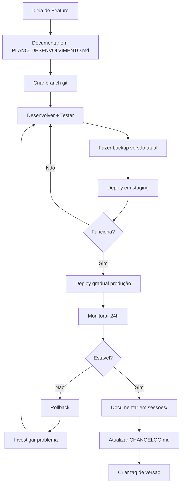

# DOCUMENTAÇÃO - Chatwoot SDR IA

**Última Atualização:** 22 de Novembro de 2025
**Versão Atual:** v2.0.0-patch2 (aa4bd4f)

---

## 📁 ESTRUTURA DE DOCUMENTAÇÃO

Esta pasta contém toda a documentação técnica, relatórios de desenvolvimento e backups do projeto Chatwoot SDR IA.

```
docs/
├── README.md                          # Este arquivo
├── PLANO_DESENVOLVIMENTO.md           # Roadmap e planejamento futuro
├── SDR_IA_MODULE_DOCUMENTATION.md     # Documentação técnica principal
├── SDR_IA_ADMIN_INTERFACE.md          # Guia do painel administrativo
├── TROUBLESHOOTING.md                 # Solução de problemas comuns
│
├── sessoes/                           # 📊 Relatórios de Sessões de Desenvolvimento
│   ├── SESSAO_2025-11-22.md          # Sessão 22/11/2025 (Patches 3-5 + Rollback)
│   └── [futuras sessões]
│
├── patches/                           # 🔧 Documentação Detalhada de Patches
│   ├── PATCH_v2.0.0-patch3.md        # Correção mensagens duplicadas (REVERTIDO)
│   ├── PATCH_v2.0.0-patch4.md        # Skip closing msg leads quentes (REVERTIDO)
│   └── [futuros patches]
│
├── versoes/                           # 📦 Snapshots de Versões Importantes
│   ├── v2.0.0-patch2-aa4bd4f.md      # Documentação versão estável atual
│   └── [futuras versões]
│
├── backups/                           # 💾 Backups Completos de Versões
│   ├── aa4bd4f/                      # Backup v2.0.0-patch2 (VERSÃO ESTÁVEL)
│   │   ├── backup_TIMESTAMP.tar.gz   # Código fonte
│   │   ├── docker_image_TIMESTAMP.tar.gz  # Imagem Docker
│   │   ├── manifest_TIMESTAMP.json   # Metadados
│   │   └── README.md                 # Como restaurar
│   └── [futuros backups]
│
└── arquitetura/                       # 🏗️ Diagramas e Documentação Técnica
    ├── ARCHITECTURE.md               # Visão geral da arquitetura
    ├── DATABASE_SCHEMA.md            # Schema do banco de dados
    ├── API_ENDPOINTS.md              # Documentação de APIs
    └── [diagramas]
```

---

## 📚 GUIA RÁPIDO

### Para Desenvolvedores

#### Iniciar Novo Desenvolvimento
1. Ler `PLANO_DESENVOLVIMENTO.md` - Entender roadmap
2. Ler última sessão em `sessoes/` - Contexto recente
3. Ler `SDR_IA_MODULE_DOCUMENTATION.md` - Detalhes técnicos
4. Fazer backup: `./scripts/backup-version.sh [tag] "[descrição]"`

#### Aplicar um Patch
1. Ler documentação do patch em `patches/`
2. Verificar versão atual: `git describe --tags`
3. Aplicar mudanças conforme documentação
4. Testar em staging (quando disponível)
5. Fazer backup antes do deploy
6. Deploy gradual em produção
7. Monitorar logs por 24h

#### Resolver Problemas
1. Consultar `TROUBLESHOOTING.md`
2. Verificar logs da sessão mais recente
3. Se crítico, restaurar backup da última versão estável

---

### Para Product Owners

#### Entender Estado do Projeto
1. Ler `PLANO_DESENVOLVIMENTO.md` - Roadmap e prioridades
2. Ler última sessão em `sessoes/` - O que foi feito recentemente
3. Consultar `CHANGELOG.md` (raiz do projeto) - Histórico de versões

#### Planejar Novas Features
1. Adicionar no `PLANO_DESENVOLVIMENTO.md` sob "Roadmap"
2. Priorizar features (Crítica/Alta/Média/Baixa)
3. Estimar esforço com time técnico
4. Documentar requisitos em nova issue

---

## 📖 DOCUMENTOS PRINCIPAIS

### 1. PLANO_DESENVOLVIMENTO.md
**O que é:** Roadmap completo do projeto
**Conteúdo:**
- Arquitetura atual
- Funcionalidades planejadas por versão
- Pendências técnicas priorizadas
- Cronograma de desenvolvimento
- Riscos e mitigações

**Quando consultar:**
- Antes de iniciar novo desenvolvimento
- Para entender próximos passos
- Ao priorizar features

---

### 2. SDR_IA_MODULE_DOCUMENTATION.md
**O que é:** Documentação técnica detalhada
**Conteúdo:**
- Como funciona o módulo SDR IA
- Fluxo de qualificação de leads
- Estrutura de arquivos
- APIs e integrações
- Variáveis de ambiente

**Quando consultar:**
- Ao desenvolver nova feature
- Para entender código existente
- Ao debugar problemas

---

### 3. SDR_IA_ADMIN_INTERFACE.md
**O que é:** Guia do painel administrativo
**Conteúdo:**
- Como configurar o sistema
- Explicação de cada campo
- Melhores práticas de configuração
- Screenshots e exemplos

**Quando consultar:**
- Ao configurar sistema pela primeira vez
- Para treinar novos usuários
- Ao ajustar parâmetros de qualificação

---

### 4. TROUBLESHOOTING.md
**O que é:** Guia de solução de problemas
**Conteúdo:**
- Problemas comuns e soluções
- Como interpretar logs
- Comandos úteis de debug
- Quando fazer rollback

**Quando consultar:**
- Sistema apresentando erro
- Comportamento inesperado
- Após deploy com problemas

---

## 📊 SESSÕES DE DESENVOLVIMENTO

Cada sessão de desenvolvimento gera um relatório detalhado em `sessoes/`.

### Estrutura de uma Sessão
```markdown
# SESSÃO DE DESENVOLVIMENTO - [DATA]

## RESUMO EXECUTIVO
- Versão inicial e final
- Objetivos da sessão
- Status final

## TRABALHOS REALIZADOS
- Patches implementados
- Bugs corrigidos
- Features adicionadas

## PROBLEMAS ENCONTRADOS
- Descrição de cada problema
- Causa raiz
- Solução aplicada

## LIÇÕES APRENDIDAS
- O que funcionou bem
- O que precisa melhorar
- Próximas ações

## ESTATÍSTICAS
- Commits criados
- Arquivos modificados
- Builds/Deploys realizados
```

### Sessões Disponíveis
- **2025-11-22** - Patches 3-5 e Rollback
  - Correção de mensagens duplicadas (tentativa)
  - Problema no painel administrativo
  - Rollback para versão estável
  - 4h 06min de trabalho

---

## 🔧 PATCHES

Cada patch tem documentação detalhada em `patches/`.

### Estrutura de um Patch
```markdown
# PATCH vX.X.X-patchN - [TÍTULO]

## PROBLEMA IDENTIFICADO
- Sintoma
- Causa raiz
- Exemplo do bug

## SOLUÇÃO IMPLEMENTADA
- Código modificado
- Lógica aplicada
- Testes realizados

## IMPACTO
- Antes vs Depois
- Benefícios
- Breaking changes (se houver)

## DEPLOY
- Comandos necessários
- Verificação pós-deploy
- Rollback (se necessário)
```

### Patches Disponíveis
- **PATCH_v2.0.0-patch3.md** (REVERTIDO)
  - Correção de mensagens duplicadas
  - 333 linhas de documentação

- **PATCH_v2.0.0-patch4.md** (REVERTIDO)
  - Skip closing message para leads quentes
  - 456 linhas de documentação

---

## 💾 BACKUPS

### Como Funciona

#### Criação de Backup
```bash
./scripts/backup-version.sh [tag_version] "[descrição]"

# Exemplo:
./scripts/backup-version.sh aa4bd4f "Versão estável antes dos patches"
```

#### O que é Incluído
1. **Código Fonte** (`backup_TIMESTAMP.tar.gz`)
   - Todos os arquivos do projeto
   - Exceto: node_modules, .git, assets compilados

2. **Imagem Docker** (`docker_image_TIMESTAMP.tar.gz`)
   - Imagem completa pronta para deploy
   - Inclui assets compilados

3. **Manifest** (`manifest_TIMESTAMP.json`)
   - Metadados da versão
   - Git commit, branch, tag
   - Timestamp, tamanho, arquivos incluídos

4. **README de Restauração**
   - Passo a passo para restaurar
   - Comandos exatos
   - Verificações pós-restauração

#### Como Restaurar
```bash
# 1. Extrair código
tar -xzf backup_TIMESTAMP.tar.gz -C /destino

# 2. Carregar imagem Docker
gunzip -c docker_image_TIMESTAMP.tar.gz | docker load

# 3. Atualizar services
docker service update --image localhost/chatwoot-sdr-ia:[TAG] chatwoot_chatwoot_app
docker service update --image localhost/chatwoot-sdr-ia:[TAG] chatwoot_chatwoot_sidekiq
```

**Consulte:** `docs/backups/[VERSION]/README.md` para instruções detalhadas

---

## 🏗️ ARQUITETURA

### Componentes Principais

```
┌─────────────────────────────────────────────┐
│         CHATWOOT SDR IA SYSTEM              │
└─────────────────────────────────────────────┘

┌──────────────┐      ┌──────────────┐      ┌──────────────┐
│   WhatsApp   │──────│     WAHA     │──────│  Chatwoot    │
│   Cliente    │      │   Webhook    │      │   Webhook    │
└──────────────┘      └──────────────┘      └──────────────┘
                                                     │
                                                     ▼
                                    ┌────────────────────────┐
                                    │   AsyncDispatcher      │
                                    │   + SdrIaListener      │
                                    └────────────────────────┘
                                              │
                                              ▼
                                    ┌────────────────────────┐
                                    │ ConversationManagerV2  │
                                    │ - Conversação Natural  │
                                    │ - Qualificação Auto    │
                                    │ - Distribuição Times   │
                                    └────────────────────────┘
                                              │
                       ┌──────────────────────┼──────────────────────┐
                       ▼                      ▼                      ▼
              ┌────────────┐        ┌────────────┐        ┌────────────┐
              │  OpenAI    │        │ PostgreSQL │        │   Sidekiq  │
              │  GPT-4     │        │  Database  │        │   Jobs     │
              └────────────┘        └────────────┘        └────────────┘
```

**Detalhes:** Ver `arquitetura/ARCHITECTURE.md` (quando criado)

---

## 🔄 FLUXO DE TRABALHO

### Desenvolvimento de Nova Feature



---

## 📞 CONTATOS E SUPORTE

### Time
- **Product Owner:** Everson Santos
- **Desenvolvedor:** Claude (Anthropic AI)
- **QA:** Everson Santos

### Canais
- **Issues:** GitHub Issues (quando disponível)
- **Docs:** Esta pasta `/docs`
- **Logs:** `docker service logs chatwoot_chatwoot_*`

---

## 🎯 MÉTRICAS DE DOCUMENTAÇÃO

### Cobertura Atual
| Área | Status | Observação |
|------|--------|------------|
| Módulo SDR IA | ✅ 100% | Completo e atualizado |
| Painel Admin | ✅ 100% | Guia detalhado |
| API Endpoints | ⚠️ 70% | Precisa Swagger/OpenAPI |
| Troubleshooting | ✅ 90% | Em constante atualização |
| Arquitetura | ⚠️ 50% | Falta diagrama detalhado |
| Testes | ❌ 0% | Não implementados |

### Últimas Atualizações
- **22/11/2025** - PLANO_DESENVOLVIMENTO.md criado
- **22/11/2025** - SESSAO_2025-11-22.md criado
- **22/11/2025** - PATCH_v2.0.0-patch3.md criado
- **22/11/2025** - PATCH_v2.0.0-patch4.md criado
- **22/11/2025** - CHANGELOG.md atualizado

---

## ✅ CHECKLIST DE DOCUMENTAÇÃO

### Ao Finalizar uma Sessão
- [ ] Criar relatório em `sessoes/SESSAO_[DATA].md`
- [ ] Atualizar `CHANGELOG.md` com mudanças
- [ ] Documentar patches em `patches/` (se aplicável)
- [ ] Fazer backup da versão estável
- [ ] Atualizar `PLANO_DESENVOLVIMENTO.md` se necessário

### Ao Criar um Patch
- [ ] Documentar problema identificado
- [ ] Explicar solução implementada
- [ ] Incluir exemplos de código
- [ ] Descrever testes realizados
- [ ] Instruções de deploy e rollback

### Ao Lançar uma Versão
- [ ] Criar entry no `CHANGELOG.md`
- [ ] Snapshot em `versoes/`
- [ ] Fazer backup completo
- [ ] Atualizar README principal
- [ ] Tag no git

---

**FIM DO README DA DOCUMENTAÇÃO**

*Mantenha esta documentação atualizada após cada sessão de desenvolvimento!*

*Última atualização: 22 de Novembro de 2025, 21:30h*
