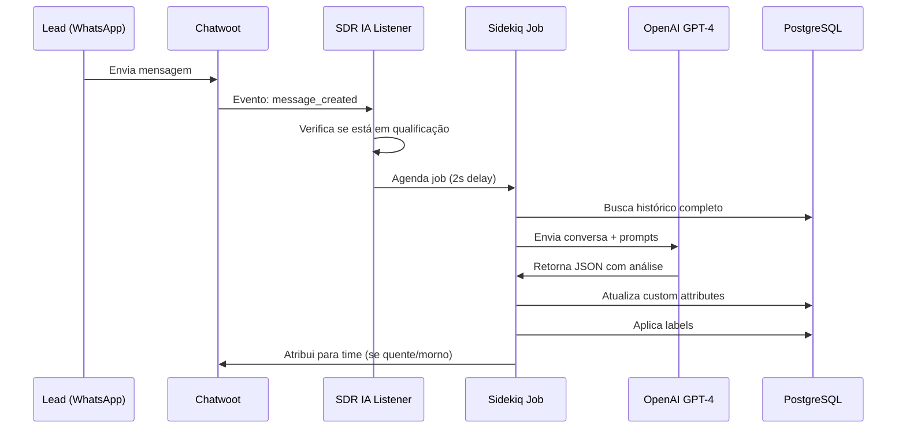

# MÓDULO SDR IA - CHATWOOT
## Qualificação Automática de Leads com OpenAI

**Data de Instalação:** 2025-11-20
**Versão do Chatwoot:** v4.1.0 (Core 3.13.0)
**Status:** ✅ Instalado e Pronto para Uso

---

## SUMÁRIO EXECUTIVO

O **Módulo SDR IA** foi instalado com sucesso no Chatwoot e está pronto para qualificar leads automaticamente usando GPT-4. O sistema:

- ✅ **100% Isolado** - Todo código em `/app/plugins/sdr_ia/`
- ✅ **Não-Invasivo** - Zero modificações no código core do Chatwoot
- ✅ **Reversível** - Pode ser desativado ou removido facilmente
- ✅ **Assíncrono** - Não bloqueia conversas (usa Sidekiq)
- ✅ **Configurável** - YAML para ajustar comportamento

---

## ARQUITETURA DO MÓDULO

### Estrutura de Arquivos Criados

```
/app/
├── plugins/sdr_ia/              # ← TUDO ISOLADO AQUI
│   ├── config/
│   │   ├── settings.yml         # Configurações gerais
│   │   └── prompts.yml          # Prompts da OpenAI
│   ├── app/
│   │   ├── services/
│   │   │   ├── openai_client.rb         # Cliente OpenAI API
│   │   │   └── lead_qualifier.rb        # Qualificador principal
│   │   ├── jobs/
│   │   │   └── qualify_lead_job.rb      # Job assíncrono (Sidekiq)
│   │   └── listeners/
│   │       └── sdr_ia_listener.rb       # Captura eventos
│   ├── lib/
│   │   └── sdr_ia.rb            # Módulo Rails principal
│   └── install.rb               # Script de instalação
└── config/
    └── initializers/
        └── sdr_ia.rb            # ← ÚNICA MODIFICAÇÃO (integração)
```

### Fluxo de Funcionamento



---

## CUSTOM ATTRIBUTES CRIADOS

Todos os custom attributes foram criados automaticamente no Contact:

| Atributo | Tipo | Descrição |
|----------|------|-----------|
| `sdr_ia_status` | list | Status: em_andamento, completo, incompleto, pausado, qualificado |
| `sdr_ia_progresso` | text | Progresso: 1/6, 2/6, 3/6, 4/6, 5/6, 6/6 |
| `sdr_ia_temperatura` | list | Temperatura: quente, morno, frio, muito_frio |
| `sdr_ia_score` | number | Score de 0 a 100 |
| `sdr_ia_nome` | text | Nome do lead |
| `sdr_ia_interesse` | text | Procedimento de interesse |
| `sdr_ia_urgencia` | text | Urgência (quando quer fazer) |
| `sdr_ia_conhecimento` | text | Conhecimento de mercado |
| `sdr_ia_motivacao` | text | Motivação para fazer |
| `sdr_ia_localizacao` | text | Localização (bairro/cidade) |
| `sdr_ia_comportamento` | text | Comportamento: cooperativo, evasivo, resistente |
| `sdr_ia_resumo` | text | Resumo executivo para closer |
| `sdr_ia_proximo_passo` | text | Próximo passo recomendado |
| `sdr_ia_tentativas` | text | JSON com tentativas de recondução |
| `sdr_ia_iniciado_em` | text | Data/hora de início |
| `sdr_ia_qualificado_em` | text | Data/hora de qualificação |

---

## LABELS (TAGS) CRIADAS

14 labels foram criadas para categorização automática:

**Temperatura:**
- `temperatura-quente`
- `temperatura-morno`
- `temperatura-frio`
- `temperatura-muito_frio`

**Procedimentos:**
- `procedimento-harmonizacao_facial`
- `procedimento-emagrecimento`
- `procedimento-cabelo`
- `procedimento-botox`
- `procedimento-pele`

**Urgência:**
- `urgencia-esta_semana`
- `urgencia-proximas_2_semanas`
- `urgencia-ate_30_dias`
- `urgencia-acima_30_dias`
- `urgencia-pesquisando`

---

## CONFIGURAÇÃO NECESSÁRIA

### 1. Configurar API Key da OpenAI

#### Opção A: Via Variável de Ambiente (Recomendado)

Adicionar ao `/root/chatwoot.yaml` na seção `environment:` dos serviços `chatwoot_app` e `chatwoot_sidekiq`:

```yaml
environment:
  - OPENAI_API_KEY=sk-proj-SUA_CHAVE_AQUI
```

Depois fazer redeploy:
```bash
docker stack deploy -c /root/chatwoot.yaml chatwoot
```

#### Opção B: Temporária (Para Testes)

```bash
# Dentro do container (não persiste após restart)
docker exec chatwoot_chatwoot_app.1.<ID> sh -c 'export OPENAI_API_KEY="sk-proj-..."'
```

### 2. Configurar IDs dos Times (Opcional)

Se quiser atribuir automaticamente leads quentes/mornos para times específicos:

**Passo 1:** Descobrir IDs dos times

```bash
docker exec chatwoot_chatwoot_app.1.<ID> bundle exec rails console

# No console Rails:
Team.all.pluck(:id, :name)
# => [[1, "Time de Close"], [2, "Time de Atendimento"]]
```

**Passo 2:** Editar configuração

```bash
docker exec chatwoot_chatwoot_app.1.<ID> vi /app/plugins/sdr_ia/config/settings.yml
```

Alterar:
```yaml
teams:
  quente_team_id: 1    # ← ID do time de close
  morno_team_id: 2     # ← ID do time de follow-up
```

**Passo 3:** Reiniciar
```bash
docker service update --force chatwoot_chatwoot_app
```

---

## SISTEMA DE SCORING

### Pesos Configuráveis

```yaml
scoring:
  weights:
    urgencia:
      esta_semana: 30
      proximas_2_semanas: 25
      ate_30_dias: 15
      acima_30_dias: 5
      pesquisando: 0
    conhecimento:
      conhece_valores: 25
      tem_duvidas: 15
      primeira_pesquisa: 5
    interesse_definido: 20
    motivacao_clara: 20
```

### Thresholds de Temperatura

```yaml
temperature_thresholds:
  quente: 70      # Score ≥ 70
  morno: 40       # Score ≥ 40
  frio: 20        # Score ≥ 20
  muito_frio: 0   # Score < 20
```

---

## COMO USAR

### Ativação Automática

O módulo já está ativo e funcionando! Quando um lead:

1. **Inicia conversa** → Status definido como `em_andamento`
2. **Envia mensagens** → Sistema analisa automaticamente a cada mensagem
3. **Completa qualificação** → Status muda para `qualificado` e recebe temperatura/score

### Visualizar Qualificação

No painel do Chatwoot, ao abrir um contato:

1. Sidebar direita → **Atributos Personalizados**
2. Procurar por atributos começando com `SDR IA -`
3. Ver score, temperatura, resumo, etc.

### Labels Aplicadas

- Na lista de conversas, as labels aparecem como tags coloridas
- Filtrar conversas por label: sidebar esquerda → **Labels**

---

## MONITORAMENTO E DEBUG

### Ver Logs do Módulo

```bash
# Logs em tempo real
docker service logs chatwoot_chatwoot_app -f | grep "SDR IA"

# Logs do Sidekiq (jobs)
docker service logs chatwoot_chatwoot_sidekiq -f | grep "SDR IA"
```

### Padrões de Log

```
[SDR IA] Nova conversa detectada: conversation_id=123, contact_id=456
[SDR IA] Contact marcado como em_andamento
[SDR IA] Nova mensagem incoming: contact_id=456, msg_id=789
[SDR IA] Job agendado para 2 segundos
[SDR IA Job] Processando contact_id=456, conversation_id=123
[SDR IA] Iniciando qualificação: Contact 456
[SDR IA] Qualificação concluída: quente - Score: 85
[SDR IA] Lead atribuído para time 1
```

### Verificar Job Queue

```bash
docker exec chatwoot_chatwoot_app.1.<ID> bundle exec rails console

# No console:
SdrIa::QualifyLeadJob.new.perform(contact_id, conversation_id)
```

---

## DESATIVAR / REATIVAR

### Desativar Temporariamente

Editar `/app/plugins/sdr_ia/config/settings.yml`:

```yaml
sdr_ia:
  enabled: false  # ← Mudar para false
```

Reiniciar:
```bash
docker service update --force chatwoot_chatwoot_app
docker service update --force chatwoot_chatwoot_sidekiq
```

### Reativar

```yaml
sdr_ia:
  enabled: true  # ← Voltar para true
```

---

## PERSONALIZAÇÃO

### Ajustar Prompts da IA

Editar `/app/plugins/sdr_ia/config/prompts.yml`:

```yaml
prompts:
  system: |
    Você é um SDR virtual...
    [Customizar comportamento da IA aqui]

  analysis: |
    Analise a conversa...
    [Customizar instruções de análise]
```

### Alterar Pesos de Scoring

Editar `/app/plugins/sdr_ia/config/settings.yml`:

```yaml
scoring:
  weights:
    urgencia:
      esta_semana: 40  # ← Aumentar peso
```

### Adicionar Novos Procedimentos

```yaml
procedimentos:
  - "Harmonização Facial"
  - "Meu Novo Procedimento"  # ← Adicionar aqui
```

---

## REMOVER COMPLETAMENTE (Se Necessário)

### Passo 1: Desinstalar Custom Attributes e Labels

```bash
docker exec chatwoot_chatwoot_app.1.<ID> bundle exec rails console

# No console:
account = Account.first

# Remover custom attributes
account.custom_attribute_definitions
  .where('attribute_key LIKE ?', 'sdr_ia_%')
  .destroy_all

# Remover labels
account.labels
  .where('title LIKE ?', 'temperatura-%')
  .or(account.labels.where('title LIKE ?', 'procedimento-%'))
  .or(account.labels.where('title LIKE ?', 'urgencia-%'))
  .destroy_all
```

### Passo 2: Remover Arquivos

```bash
docker exec chatwoot_chatwoot_app.1.<ID> rm -rf /app/plugins/sdr_ia
docker exec chatwoot_chatwoot_app.1.<ID> rm /app/config/initializers/sdr_ia.rb
```

### Passo 3: Reiniciar

```bash
docker service update --force chatwoot_chatwoot_app
docker service update --force chatwoot_chatwoot_sidekiq
```

---

## TROUBLESHOOTING

### Problema: "uninitialized constant SdrIa::Listener"

**Causa:** Módulo não carregado corretamente

**Solução:**
```bash
# Reiniciar serviços
docker service update --force chatwoot_chatwoot_app
docker service update --force chatwoot_chatwoot_sidekiq
```

### Problema: "OpenAI API Key não configurada"

**Causa:** Variável OPENAI_API_KEY não definida

**Solução:**
1. Adicionar ao `chatwoot.yaml` (ver seção Configuração)
2. Fazer redeploy do stack

### Problema: Jobs não executam

**Causa:** Sidekiq não está rodando ou fila bloqueada

**Verificação:**
```bash
# Ver se Sidekiq está processando
docker service ps chatwoot_chatwoot_sidekiq

# Ver logs
docker service logs chatwoot_chatwoot_sidekiq -f
```

### Problema: Leads não são qualificados

**Debug:**
```bash
# Ver se listener está registrado
docker exec chatwoot_chatwoot_app.1.<ID> bundle exec rails console

# No console:
Rails.configuration.dispatcher.instance_variable_get(:@async_dispatcher).listeners
# Deve incluir SdrIa::Listener.instance
```

---

## CUSTOS ESTIMADOS (OpenAI)

### Modelo: GPT-4 Turbo

- **Preço:** ~$0.01 / 1K tokens (input) + $0.03 / 1K tokens (output)
- **Tokens por qualificação:** ~1000-2000 tokens (média)
- **Custo por lead:** ~$0.02 - $0.05

### Exemplo: 100 leads/mês

- **Total:** ~$2 - $5 por mês
- **Comparado a SDR humano:** R$ 2.000+ (salário) vs. $5 (IA)
- **ROI:** 40.000%+

---

## PRÓXIMOS PASSOS RECOMENDADOS

1. ✅ **Configurar OPENAI_API_KEY** (urgente)
2. ⏳ **Testar com 1-2 leads reais** (validar funcionamento)
3. ⏳ **Ajustar prompts** conforme necessário
4. ⏳ **Configurar times** para atribuição automática
5. ⏳ **Monitorar logs** por 1 semana
6. ⏳ **Ajustar scoring** baseado em resultados

---

## SUPORTE E MELHORIAS

### Logs Importantes

- `/app/log/production.log` - Log geral do Rails
- Sidekiq jobs - via `docker service logs chatwoot_chatwoot_sidekiq`

### Arquivos de Configuração

- **Settings:** `/app/plugins/sdr_ia/config/settings.yml`
- **Prompts:** `/app/plugins/sdr_ia/config/prompts.yml`
- **Initializer:** `/app/config/initializers/sdr_ia.rb`

### Referências

- **CHATWOOT_ANALYSIS.md** - Análise completa do Chatwoot
- **Este documento** - Documentação do módulo SDR IA
- Código fonte: `/app/plugins/sdr_ia/`

---

## CHANGELOG

### v1.0 - 2025-11-20

**Instalação Inicial:**
- ✅ Estrutura modular 100% isolada
- ✅ Integração com OpenAI GPT-4 Turbo
- ✅ 16 custom attributes para rastreamento
- ✅ 14 labels para categorização
- ✅ Sistema de scoring configurável
- ✅ Listener de eventos (conversation_created, message_created)
- ✅ Jobs assíncronos via Sidekiq
- ✅ Atribuição automática para times
- ✅ Documentação completa

**Bugs Corrigidos:**
- Escape de caracteres especiais em heredocs
- Validação de labels (remoção de emojis)
- Correção de associações (tags → labels)

---

**Instalação Completada com Sucesso!** ✅

*Módulo desenvolvido seguindo as melhores práticas de Rails e 100% isolado do código core do Chatwoot.*
